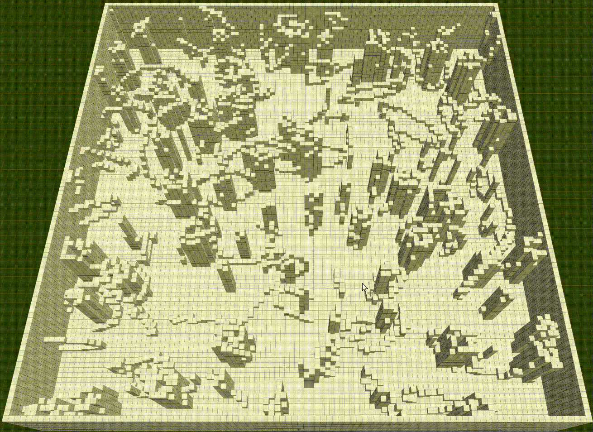
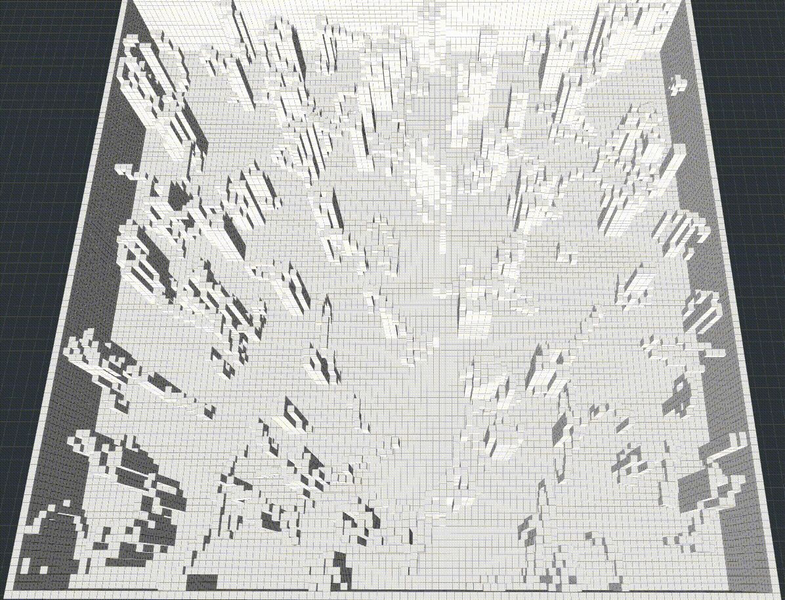
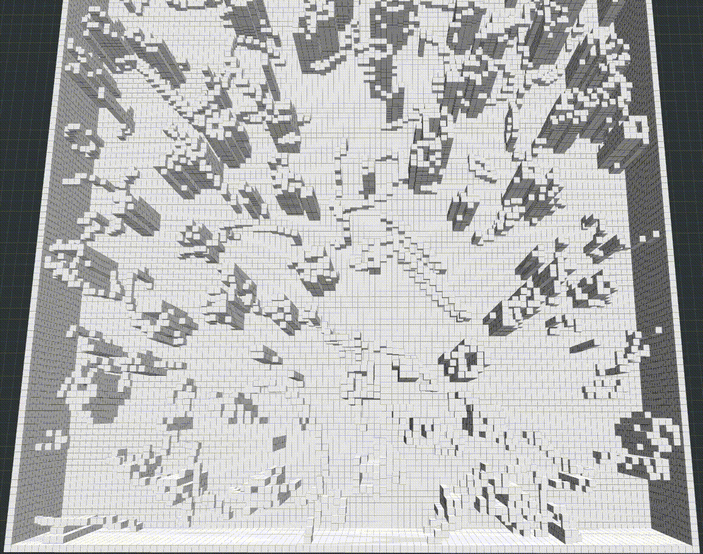
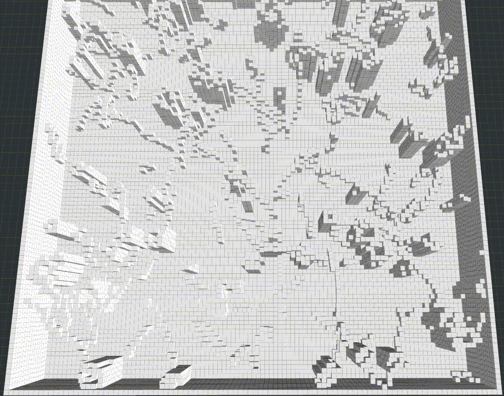

# C++ implementation and visualization of some sampling-based path planners

## Build & Run
### Build
1. git clone git@github.com:ZJU-FAST-Lab/sampling-based-path-finding.git
2. cd sampling-based-path-finding/
3. catkin_make

### Run
In two seperate terminals, _source_ first, then:
1. roslaunch path_finder rviz.launch
2. roslaunch path_finder test_planners.launch

In Rviz panel, add a new tool "Goal3DTool", press keyboard "g" and use mouse to set goals.

## RRT
_LaValle, S.M. (1998). Rapidly-exploring random trees : a new tool for path planning. The annual research report_.

  

## RRT*
### Original

_Karaman, Sertac, and Emilio Frazzoli. “Sampling-Based Algorithms for Optimal Motion Planning.” The International Journal of Robotics Research, vol. 30, no. 7, June 2011, pp. 846–894, doi:10.1177/0278364911406761_.

  

### RRT* with informed sampling

_J. D. Gammell, T. D. Barfoot and S. S. Srinivasa, "Informed Sampling for Asymptotically Optimal Path Planning," in IEEE Transactions on Robotics, vol. 34, no. 4, pp. 966-984, Aug. 2018, doi: 10.1109/TRO.2018.2830331_.

  

### RRT* with GUILD sampling

_Aditya Mandalika and Rosario Scalise and Brian Hou and Sanjiban Choudhury and Siddhartha S. Srinivasa, Guided Incremental Local Densification for Accelerated Sampling-based Motion Planning," in Arxiv, 2021, https://arxiv.org/abs/2104.05037_

  

## RRT#
### Original

_O. Arslan and P. Tsiotras, "Use of relaxation methods in sampling-based algorithms for optimal motion planning," 2013 IEEE International Conference on Robotics and Automation, 2013, pp. 2421-2428, doi: 10.1109/ICRA.2013.6630906_.

  

### RRT# with informed sampling

  

### RRT# with GUILD sampling

  

## Bidirectional RRT
### RRT-connect (BRRT)

_Kuffner, James J., and Steven M. LaValle. "RRT-connect: An efficient approach to single-query path planning." Proceedings 2000 ICRA._

  

### IB-RRT*

_Qureshi, Ahmed Hussain, and Yasar Ayaz. "Intelligent bidirectional rapidly-exploring random trees for optimal motion planning in complex cluttered environments." Robotics and Autonomous Systems 68 (2015): 1-11._

  

### IB-RRT* with informed sampling

  

